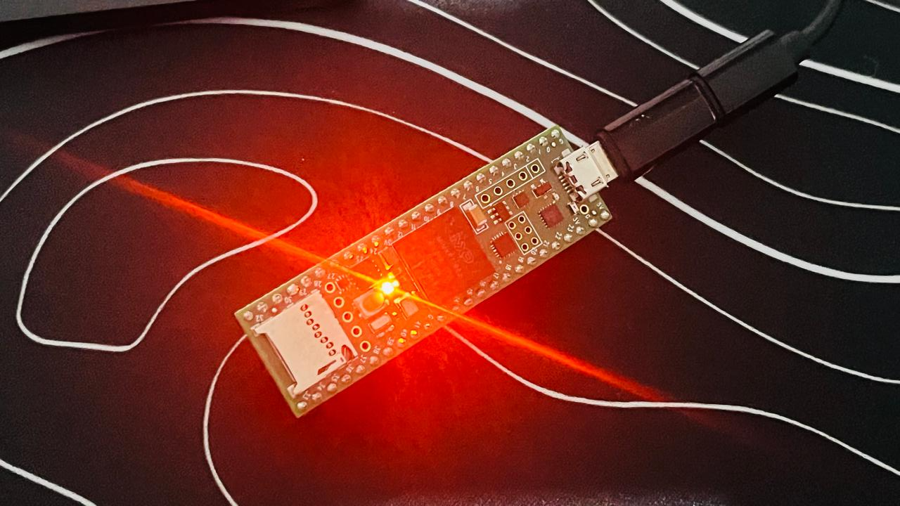
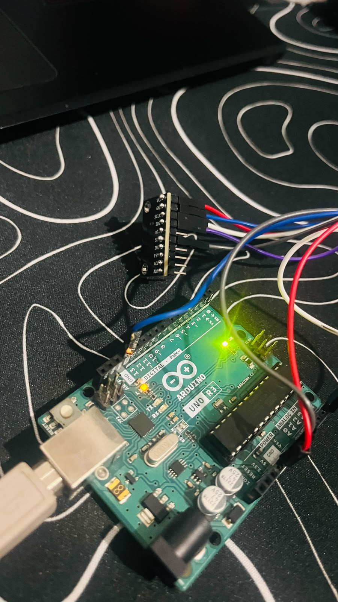
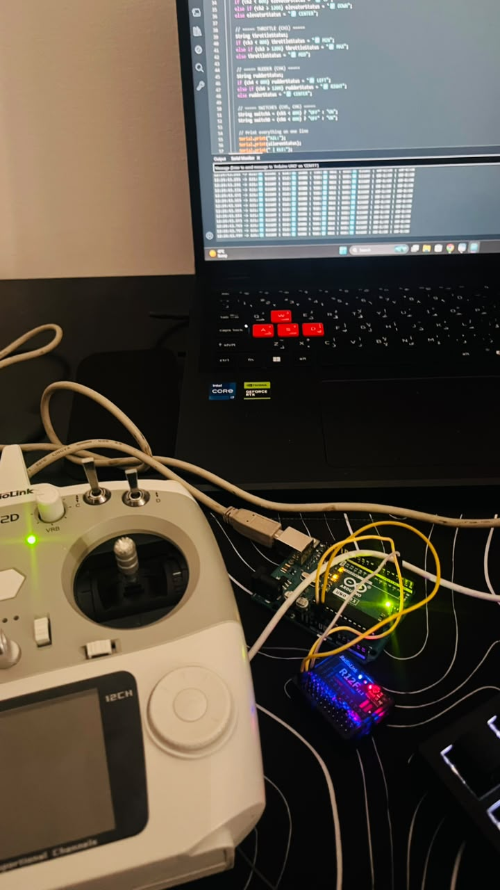
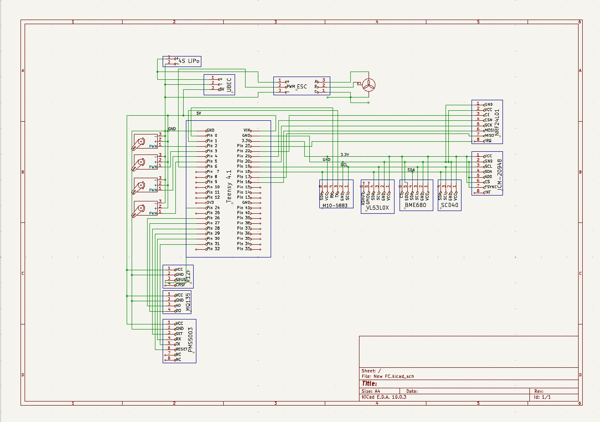

# TFCS-1: Teensy Flight Computer & Climate Suite

[](#hardware)[](#status)[](#author)

> **WARNING: Active Development**Expect changes to hardware wiring, sensor selection, and software builds as this project continues through testing and validation.

> **AI Transparency Disclosure**All system architecture, hardware selection, circuit design, and physical builds are designed and wired by me. AI was used only as a sounding board for code formatting, debugging, and documentation polish. The soldering, hardware decisions, and flight-control logic are human-built.

**TFCS-1** is an open-source flight controller and environmental sensing platform built around the **Teensy 4.1**. It combines flight-control sensing, servo control, radio input, telemetry, and atmospheric data logging for experimental aircraft and environmental monitoring.

- **GitHub:** [github.com/R1th1shwork/TFCS-1](https://github.com/R1th1shwork/TFCS-1)

- **Stardance:** [stardance.hackclub.com/projects/49798](https://stardance.hackclub.com/projects/49798)

---

## Project Assets

### Images and Media

| File | Description |
| --- | --- |
| `Assets/ten.png` | Teensy 4.1 microcontroller, the brain of TFCS-1 |
| `Assets/rf.jpeg` | RadioLink R12F SBUS receiver test |
| `Assets/icm.jpeg` | ICM-20948 9-DOF IMU, borrowed for development |
| `Assets/schematics.jpeg` | Earlier wiring diagram for the flight controller |

### Videos

| File | Description |
| --- | --- |
| `TFCS-1_Stardance_Ailerons.mp4` | Aileron servo demonstration |
| `ailerons test.mp4` | Aileron test footage |

> **Full Video Demos:** [Google Drive Folder](https://drive.google.com/drive/folders/199b-1cK7TjypQ-vlO30ZAJLWgoHDL5SH)

### Firmware and Hardware Design Files

| File | Description |
| --- | --- |
| `TFCS-1_All_Surfaces.ino` | Flight-controller code for ailerons, elevator, and rudder |
| `TFCS_1_SBUS.ino` | RadioLink SBUS receiver test code |
| `Codes/New FC.kicad_sch` | Current KiCad schematic for the flight-controller architecture |

The current schematic is included in the `Codes` directory. It documents the planned controller, power, sensor, receiver, telemetry, and servo connections. The schematic is being updated as the sensor suite is tested and final component choices are confirmed.

---

## Table of Contents

- [Why I Built This](#why-i-built-this)

- [Story / Behind the Scenes](#story--behind-the-scenes)

- [Current Status](#current-status)

- [Hardware](#hardware)

- [Wiring Instructions](#wiring-instructions)

- [Schematic and PCB Design](#schematic-and-pcb-design)

- [Control Surfaces](#control-surfaces)

- [Software](#software)

- [Setup](#setup)

- [Telemetry](#telemetry)

- [Challenges and Fixes](#challenges-and-fixes)

- [Roadmap](#roadmap)

- [Future Funding and BOM](#future-funding-and-bom)

- [Equipment Status](#equipment-status)

- [Testing Plan](#testing-plan)

- [Contributing](#contributing)

- [Author](#author)

- [Acknowledgments](#acknowledgments)

- [Disclaimer](#disclaimer)

---

## Why I Built This

I am a 16-year-old maker obsessed with flight. I did not start with a kit or a pre-built flight controller. I started with a soldering iron, a breadboard, and the determination to understand every wire and every line of code that keeps a plane in the air.

This project exists because:

- I want to **learn** flight-controller tuning, sensor fusion, and embedded systems from first principles.

- I want to **open-source** every finding, failure, and fix so the next builder does not start from zero.

- I believe the best way to learn is to build, break, and rebuild, one test at a time.

---

## Story / Behind the Scenes

### The Beginning

The Teensy 4.1 arrived from my tutor, a 600 MHz board I had been reading about for months. The first time the orange LED blinked, I knew this was real. Then came the ICM-20948, the 9-DOF IMU that was supposed to be the heart of the system. It did not work reliably. An I2C scan found it at `0x68`, but the moment I tried to read data, the bus could hang. No pull-up resistors, possible logic-level issues, or simply inexperience could have contributed. I spent hours staring at wires that refused to talk.

### The Breakthrough

I switched to the MPU-6050. Cheap, common, and suddenly it just worked. Data flowed. Numbers moved when I tilted the board. I connected the first servo and watched a control surface respond to my hands. That moment, seeing physics turn into servo motion, is when TFCS-1 became more than a project. It became a flight controller.

### The Reality Check

Not everything worked. Pin 8 was unreliable for my servo setup. The ICM-20948 still needs further debugging and testing. I salvaged wings from an old RC plane, pulled servos from crashed airframes, and learned that “working” in electronics often means “working after the 47th try.” Every buzz, every jitter, and every frozen I2C bus taught me something.

The sensor suite is also evolving through testing. I am currently validating the PMS5003, SCD40, MQ-135, BME680, GPS, compass, and other modules before committing to the final PCB layout. This is intentional: I want the final board to be based on tested sensors rather than assumptions.

### Why Open Source?

Because I learned from open-source projects. Because someone else out there is 16 years old, staring at a breadboard, wondering why their sensor will not respond. This is for them. This is for the builders who learn by breaking things.

---

## Current Status

| Module | Status | Notes |
| --- | --- | --- |
| MPU-6050 roll and pitch | Done | Working reliably on the bench |
| Elevator servo | Done | Pin 5, 40–140 degrees |
| Rudder servo | Done | Pin 6, 60–120 degrees |
| Aileron servos | Done | Pins 9 and 10, 40–140 degrees |
| Low-pass filter | Done | `ALPHA = 0.15` reduces jitter |
| Deadband | Done | `0.8 degrees` reduces servo buzzing |
| Serial telemetry | Done | 115200 baud |
| Flight-control logic | Bench tested | Roll and pitch correction logic implemented |
| RadioLink SBUS receiver | Done | Six channels reading correctly |
| PMS5003 particulate sensor | Tested | PM1.0, PM2.5, and PM10 data received |
| SCD40 CO2 sensor | Tested | CO2, temperature, and humidity data received |
| MQ-135 gas sensor | Tested | Raw analogue gas-trend data received; calibration still required |
| BME680 | Planned | To be integrated after current sensor validation |
| M10 GPS | Planned / integrating | UART position and flight-data testing |
| Compass | Planned / integrating | I2C heading testing and calibration required |
| SD-card logging | In progress | CSV logging architecture planned |
| RF telemetry | In progress | Packet architecture being tested |
| OLED ground receiver | Planned | Nano-based receiver display |
| Teensy 4.1 integration | In progress | Borrowed development unit |
| ICM-20948 9-DOF fusion | In progress | Needs debugging and validation |
| FPV system | Planned | 5.8 GHz camera and transmitter |
| Current schematic | Added | `Codes/New FC.kicad_sch` |
| Final custom PCB | Planned | Will be designed after the final sensor set is validated |

**Current test platform:** E-flite Apprentice S1E, 1500 mm wingspan, 840 KV motor.

> **Note:** The Apprentice is heavily damaged after a crash and cannot currently be flown. It is being used as a bench-test body and mechanical reference. Final flight testing will require an appropriate airframe, supervision, and any permissions required by the test location.

---

## Hardware



### Compute and Avionics

| Component | Model | Specs | Status |
| --- | --- | --- | --- |
| Primary controller | Teensy 4.1 | 600 MHz ARM Cortex-M7, 1 MB RAM | **BORROWED** |
| Development controller | Arduino Uno R3 | 16 MHz ATmega328P | Owned |
| Current IMU | MPU-6050 | 6-DOF accelerometer and gyroscope | Owned |
| Future IMU | ICM-20948 | 9-DOF accelerometer, gyroscope, and magnetometer | **BORROWED** |
| GPS module | M10-based GPS module | UART, position and timing data | Being integrated |
| Compass | External I2C magnetometer | Heading reference | To be tested |
| Radio receiver | RadioLink R12F | SBUS receiver | Owned |
| Radio transmitter | RadioLink T12D | 12 channels | Owned |
| Environmental sensors | PMS5003, SCD40, MQ-135, BME680 | Particulate, CO2, gas-trend, and atmospheric data | Being validated |



### Actuators

| Component | Pin | Range | Status |
| --- | --- | --- | --- |
| Left aileron | 9 | 40–140 degrees | Owned |
| Right aileron | 10 | 40–140 degrees | Owned |
| Elevator | 5 | 40–140 degrees | Owned |
| Rudder | 6 | 60–120 degrees | Owned |
| ESC | — | 30 A with BEC | Owned |



### Power

| Component | Specs | Status |
| --- | --- | --- |
| UBEC | 7 A, 5 V output | Owned |
| Battery | 4S 3000 mAh | To be purchased or supplied for final flight testing |
| Power distribution | Custom board or final PCB power section | Planned |

### Current and Planned Additions

- [x] Current schematic added to `Codes/New FC.kicad_sch`

- [x] PMS5003 tested

- [x] SCD40 tested

- [x] MQ-135 tested as a raw gas-trend sensor

- [ ] Teensy 4.1 full integration

- [ ] BME680 integration

- [ ] M10 GPS integration

- [ ] Compass integration and calibration

- [ ] MicroSD card logging

- [ ] RF telemetry

- [ ] OLED ground receiver

- [ ] FPV camera and VTX

- [ ] Final sensor validation

- [ ] Final custom PCB design and fabrication

- [ ] Airspeed sensor integration

- [ ] Professional barometer integration

---

## Wiring Instructions

> **Note:** Pin assignments below describe the current development architecture. They may change as the final sensor and controller configuration is validated.

### MPU-6050 and ICM-20948

| Pin | Teensy 4.1 | Arduino Uno | Function |
| --- | --- | --- | --- |
| VCC | 3.3 V | 3.3 V | Check the breakout-board voltage requirements |
| GND | GND | GND | Ground |
| SDA | 18 | A4 | I2C data |
| SCL | 19 | A5 | I2C clock |

### M10 GPS Module

| GPS pin | Controller connection | Function |
| --- | --- | --- |
| VCC | Regulated supply specified by the module | Power |
| GND | Common GND | Ground |
| TX | Hardware UART RX | GPS NMEA data |
| RX | Hardware UART TX, optional | GPS configuration |
| SDA/SCL | Only if the module is configured for I2C | Optional alternate interface |
| PPS | Optional digital input | Timing pulse |

The GPS and PMS5003 are both serial devices. They must not share the same UART receive pin at the same time. A second UART, a tested software UART, an external UART bridge, or a second controller may be required for simultaneous use.

### Compass

| Compass pin | Controller connection | Function |
| --- | --- | --- |
| VCC | Correct regulated voltage for the breakout | Power |
| GND | Common GND | Ground |
| SDA | I2C SDA | Heading data |
| SCL | I2C SCL | I2C clock |

The compass and MPU6050 can share the same I2C bus if their addresses do not conflict. The compass must be mounted away from motors, ESCs, high-current battery wires, and ferromagnetic hardware. It requires calibration and tilt-compensated sensor fusion before its output can be used as a reliable aircraft yaw estimate.

### RadioLink R12F SBUS

| Pin | Teensy 4.1 | Arduino Uno | Function |
| --- | --- | --- | --- |
| VCC | 5 V | 5 V | Power |
| GND | GND | GND | Ground |
| SBUS signal | Pin 3 or a suitable hardware serial input | Pin 3 during development | Receiver data |

### Servos

| Component | Teensy 4.1 | Arduino Uno | Wire/function |
| --- | --- | --- | --- |
| Elevator signal | Pin 5 | Pin 5 | Orange signal wire |
| Rudder signal | Pin 6 | Pin 6 | Orange signal wire |
| Left aileron signal | Pin 9 | Pin 9 | Orange signal wire |
| Right aileron signal | Pin 10 | Pin 10 | Orange signal wire |
| Servo VCC | External 5 V BEC | External 5 V BEC | Red wire |
| Servo GND | Common GND | Common GND | Brown or black wire |

### Power

| Connection | Description |
| --- | --- |
| UBEC input | Battery input within the UBEC’s specified range |
| UBEC output | Regulated 5 V for the controller or approved peripherals |
| Sensor rails | Use the correct 3.3 V or 5 V rail for each breakout board |
| RF module rail | Use a stable regulated 3.3 V supply and local decoupling |
| Ground | Connect all signal-system grounds together |

Never connect a raw LiPo battery directly to a controller or sensor. Always verify polarity, voltage, and current capacity before powering the system.

### Quick Reference

| Component | Power | Ground | Signal |
| --- | --- | --- | --- |
| MPU-6050 | 3.3 V or approved breakout voltage | GND | SDA to A4, SCL to A5 |
| Compass | Approved breakout voltage | GND | SDA to A4, SCL to A5 |
| M10 GPS | Approved module voltage | GND | UART TX to controller RX |
| RadioLink R12F | 5 V | GND | SBUS input |
| PMS5003 | Usually 5 V | GND | UART TX input |
| SCD40 | Approved breakout voltage | GND | SDA to A4, SCL to A5 |
| MQ-135 | Usually 5 V | GND | AOUT to analogue input |
| Elevator | External 5 V BEC | Common GND | Pin 5 |
| Rudder | External 5 V BEC | Common GND | Pin 6 |
| Left aileron | External 5 V BEC | Common GND | Pin 9 |
| Right aileron | External 5 V BEC | Common GND | Pin 10 |

---

## Schematic and PCB Design

The current schematic has now been added to the repository at:

```
Codes/New FC.kicad_sch
```


This file represents the current electrical architecture and is being updated as the sensor suite is tested. It includes the controller, power rails, sensor interfaces, receiver input, telemetry interfaces, and servo outputs.

The final PCB has **not** yet been fabricated. This is intentional because the sensor set and exact component choices are still being validated. The final board should be based on tested sensors, confirmed footprints, verified voltage levels, and measured power requirements.

The next hardware-design stage is a modular Rev A PCB design with removable connectors for the sensors. This allows the sensor models to be changed without redesigning the complete board. After the final sensor set is confirmed through bench testing, a final Rev B PCB will be designed and fabricated.

### Planned PCB interfaces

| Interface | Purpose |
| --- | --- |
| Controller headers | Teensy 4.1 connection |
| I2C headers | MPU6050, compass, SCD40, BME680, and compatible sensors |
| GPS UART header | M10 GPS connection |
| Environmental UART header | PMS5003 connection |
| Analogue header | MQ-135 and future analogue sensors |
| SPI header | SD card and telemetry peripherals |
| SBUS header | RadioLink receiver |
| Servo headers | Aileron, elevator, and rudder outputs |
| Power section | Battery input, regulated 5 V, regulated 3.3 V, protection, and test points |

> **Design status:** Schematic added. Final PCB fabrication is pending final sensor validation and confirmed component selection.

---

## Control Surfaces

| Axis | Surface | Pin | Range | Response |
| --- | --- | --- | --- | --- |
| Pitch | Elevator | 5 | 40–140 degrees | Nose attitude correction |
| Yaw | Rudder | 6 | 60–120 degrees | Directional correction |
| Roll | Left aileron | 9 | 40–140 degrees | Mirrored roll response |
| Roll | Right aileron | 10 | 40–140 degrees | Mirrored roll response |

**Neutral position for all servos:** 90 degrees.

---

## Software

### Current Features

| Feature | Implementation | Status |
| --- | --- | --- |
| I2C communication | `Wire` library | Done |
| Angle calculation | Accelerometer-based roll and pitch | Done |
| Digital filtering | Exponential moving average, `ALPHA = 0.15` | Done |
| Deadband | `0.8 degrees` | Done |
| Servo control | Four servos | Bench tested |
| Telemetry output | Serial Monitor at 115200 baud | Done |
| SBUS receiver | RadioLink R12F, six channels | Done |
| PMS5003 reading | Serial particulate data | Tested |
| SCD40 reading | I2C CO2, temperature, and humidity | Tested |
| MQ-135 reading | Analogue raw trend data | Tested; calibration pending |

### Control Loop

| Parameter | Value |
| --- | --- |
| Loop rate | 50 Hz, 20 ms |
| Filter | Exponential moving average |
| Alpha | 0.15 |
| Deadband | 0.8 degrees |
| Telemetry baud | 115200 |

### Key Code Snippet

```cpp
// Exponential Moving Average Filter
filteredPitch = (ALPHA * rawPitch) + ((1.0 - ALPHA) * filteredPitch);

// Deadband to prevent servo buzzing
if (abs(filteredPitch) < 0.8) {
  elevatorPos = 90;
}

// Map to servo positions
elevatorPos = map(filteredPitch, -20, 20, 140, 40);
```

---

## Setup

### 1. Install Libraries

```cpp
#include <Wire.h>    // I2C communication
#include <Servo.h>   // Servo control
#include <sbus.h>    // SBUS receiver
```

Additional sensor libraries will be added once each sensor is confirmed and the final controller platform is locked.

### 2. Upload

1. Select the correct board, either **Arduino Uno** for development or **Teensy 4.1** for the main controller.

1. Select the correct COM port.

1. Upload the firmware.

1. Open Serial Monitor at **115200 baud**.

### 3. Bench Test Procedure

| Test | Expected behavior |
| --- | --- |
| Hold board level | Servos remain near 90 degrees |
| Tilt nose down | Elevator responds in the configured direction |
| Tilt nose up | Elevator responds in the configured direction |
| Tilt left | Ailerons respond in opposite directions |
| Tilt right | Ailerons respond in opposite directions |
| Rotate compass | Heading changes after calibration |
| Expose PMS5003 to changing air conditions | PM readings respond after the sensor’s response delay |
| Change CO2 conditions safely | SCD40 reading changes over time |
| Move MQ-135 near a controlled test source | Raw trend value changes; no uncalibrated ppm claim |

All motor and propeller testing must be performed safely and separately from sensor and servo bench testing.

---

## Telemetry

```
P:0.0 deg (Elev:90 deg) | R:0.0 deg (Rudd:90 deg) | A:90 deg
P:-5.2 deg (Elev:77 deg) | R:0.0 deg (Rudd:90 deg) | A:77 deg
P:10.1 deg (Elev:65 deg) | R:0.0 deg (Rudd:90 deg) | A:65 deg
```

**Key:**

- `P`: Filtered pitch angle in degrees

- `Elev`: Elevator position

- `R`: Filtered roll angle in degrees

- `Rudd`: Rudder position

- `A`: Aileron position

The planned environmental telemetry will include CO2, PM1.0, PM2.5, PM10, temperature, humidity, pressure, GPS position, battery state, and sensor-health flags. The RF packet layout will be kept within the selected radio’s payload limit, with environmental and flight-status data split into separate packets where necessary.

---

## Challenges and Fixes

| Challenge | Solution |
| --- | --- |
| ICM-20948 not working reliably | Switched to the MPU-6050 for current development |
| Servo jitter | Added low-pass filtering with `ALPHA = 0.15` |
| Servo buzzing at level | Added a `0.8 degree` deadband |
| Pin 8 unreliable for a servo | Switched to Pins 5, 6, 9, and 10 |
| MPU not responding | Fixed wiring and added debug code |
| Servos moving in the same direction | Added mirrored mounting logic |
| I2C hanging | Improved wiring and added pull-up resistors where required |
| SBUS receiver not reading | Corrected signal wiring and installed the SBUS library |
| PMS5003 serial testing | Tested the sensor independently before integration |
| Changing sensor list | Using modular connectors and delaying final PCB fabrication |
| RF payload size | Splitting telemetry into smaller packets within the radio limit |

---

## Roadmap

### Immediate

- [x] Add the current KiCad schematic to `Codes/New FC.kicad_sch`

- [x] Test the PMS5003

- [x] Test the SCD40

- [x] Test the MQ-135 raw reading

- [ ] Complete Teensy 4.1 integration

- [ ] Integrate the M10 GPS

- [ ] Integrate and calibrate the compass

- [ ] Integrate the BME680

- [ ] Add SD-card CSV logging

- [ ] Test RF telemetry

- [ ] Build the OLED ground receiver

### Next Stage

- [ ] Validate the complete sensor suite on the bench

- [ ] Record repeatable environmental test data

- [ ] Create the modular Rev A PCB layout

- [ ] Verify all footprints, voltage rails, and power requirements

- [ ] Test the full controller with motors disconnected

- [ ] Integrate the final sensor set into the aircraft

### Future

- [ ] Fabricate the final custom PCB after sensor validation

- [ ] Full 6-axis sensor fusion using Madgwick or Mahony filtering

- [ ] MAVLink telemetry protocol

- [ ] Waypoint navigation

- [ ] Ground station for Android or PC

- [ ] AI-assisted flight tuning

- [ ] Airspeed-sensor integration

- [ ] Professional barometer integration

- [ ] FPV system integration

- [ ] Authorised real-flight testing

---

## Future Funding and BOM

With funding from Stardance, the sensor suite will become a much more complete and testable system. The funding will help me purchase higher-quality components and validate the Teensy 4.1 flight controller under real test conditions.

The exact sensor selection is still being validated. I have intentionally kept the final PCB fabrication separate from the initial sensor testing so that the final board is based on confirmed components rather than untested assumptions.

### Full BOM

| Item | Description | Qty | Price (AED) | Price (USD) | Link |
| --- | --- | --- | --- | --- | --- |
| SLONWAKE 1W VTX + 1500TVL Camera | 5.8 GHz 48CH FPV transmitter with camera | 1 | 151.95 | 41.36 | [AliExpress](https://ar.aliexpress.com/item/1005008177732104.html) |
| GY-63 MS5611 Barometer | High-precision air-pressure sensor module | 1 | 16.69 | 4.54 | [AliExpress](https://ar.aliexpress.com/item/32981169861.html) |
| MS4525DO Airspeed Sensor | Differential-pressure module with Pitot tube kit | 1 | 107.19 | 29.18 | [AliExpress](https://ar.aliexpress.com/item/1005009943453550.html) |
| 4S 3000 mAh LiPo Battery | 14.8 V, 60C RC battery with XT60 connector | 1 | 141.86 | 38.62 | [AliExpress](https://ar.aliexpress.com/item/1005010778424365.html) |
| SX1278 LoRa Ra-01 Module | 433 MHz long-range telemetry module, pack of 2 | 2 | 19.60 | 5.34 | [AliExpress](https://ar.aliexpress.com/item/1005007345198584.html) |
| BSS138 Logic Level Converter | Bidirectional 4-channel 3.3 V to 5 V converter | 1 | 10.00 | 2.72 | [Noon](https://www.noon.com/uae-en/bss138-logic-level-converter-bi-directional-4-channel-3-3v-5v-bi-directional/ZF14BBDADB787D14A80DAZ/p/) |
| MPU-9250 9-Axis IMU | Gyroscope, accelerometer, and magnetometer sensor | 1 | 20.00 | 5.44 | [Noon](https://www.noon.com/uae-en/mpu-9250-gy-9250-9-axle-16-bit-gyroscope-acceleration-magnetic-sensor-3-5v/ZAC72641E953208FED97AZ/p/) |
| BMP280 Barometer | Temperature and atmospheric-pressure sensor | 1 | 6.02 | 1.64 | [AliExpress](https://ar.aliexpress.com/item/1005012294605575.html) |
| AliExpress Shipping | Shipping fee for AliExpress order | 1 | 32.28 | 8.79 | — |
| UAE Import Tax | Estimated import tax and clearance fees | 1 | 40.00 | 10.90 | — |
| **GRAND TOTAL** |  |  | **541.38** | **147.50** |  |

*Exchange rate used in the original estimate: 1 USD = 3.6725 AED.*

### What This Funding Will Unlock

- Complete Teensy 4.1 flight-controller integration

- Higher-quality IMU, barometer, airspeed, telemetry, and FPV hardware

- Real bench and authorised flight testing

- Environmental sensor validation and data logging

- Modular PCB design followed by final PCB fabrication after the sensor set is confirmed

- Open-source release of firmware, schematic files, and future PCB design files

---

## Equipment Status

| Component | Status | Source |
| --- | --- | --- |
| Teensy 4.1 | **BORROWED** | Tutor, three months |
| ICM-20948 | **BORROWED** | Tutor, three months |
| MPU-6050 | Owned | — |
| Arduino Uno | Owned | — |
| M10 GPS module | Owned or being integrated | — |
| E-flite Apprentice S1E | **BROKEN** | Crashed, used for bench testing |
| Servos, four units | Owned | Recovered from old plane |
| 7 A UBEC | Owned | — |
| ESC | Owned | — |
| RadioLink T12D and R12F | Owned | Recently purchased |

**Special thanks:** A huge thank you to my tutor for lending me the expensive components, especially the Teensy 4.1 and ICM-20948. Without that support, this project would not be possible.

---

## Testing Plan

The project is being tested in stages. First, each sensor and interface is tested independently. Next, the controller, telemetry, logging, and sensor suite are tested together on the bench. After the final sensor choices are confirmed, the modular PCB design will be updated and the final PCB can be fabricated.

For flight testing, I will use an appropriate airframe and conduct testing only with suitable supervision, safety procedures, and any permissions required by the location. The damaged Apprentice is not being treated as a flyable aircraft.

### Validation evidence planned

- Sensor readings recorded over time

- CSV logs from the SD card

- GPS position and timing data

- IMU and compass calibration results

- RF packet-loss and range tests

- Servo-response and control-surface tests

- Power-rail voltage measurements

- Photographs of the assembled electronics

- Schematic and PCB design exports

- Flight-test videos and logs when authorised and safe

---

## Contributing

This is open-source and contributions are welcome.

### How to Contribute

1. Fork the repository.

1. Create a feature branch.

1. Commit your changes.

1. Push the branch.

1. Open a Pull Request with a clear explanation of the changes.

### Areas Needing Help

- Testing on different hardware

- Documentation improvements

- Modular PCB design

- Sensor-fusion algorithms

- Telemetry protocols

- Ground-station software

- Environmental-data visualisation

- Flight-test planning and safety review

---

## Author

**Rithish** — 16-year-old maker with a passion for flight and embedded systems.

- **GitHub:** [github.com/R1th1shwork](https://github.com/R1th1shwork)

- **Project:** [github.com/R1th1shwork/TFCS-1](https://github.com/R1th1shwork/TFCS-1)

- **Stardance:** [stardance.hackclub.com/projects/49798](https://stardance.hackclub.com/projects/49798)

---

## Acknowledgments

- **My tutor** — For lending critical components.

- **The Arduino community** — For open-source libraries and support.

- **The Teensy community** — For the incredible Teensy platform.

- **Open-source hardware and software contributors** — For making it possible to learn by building.

---

## Disclaimer

> This project is for educational and experimental purposes only. Always test flight hardware thoroughly before actual flight operations. Follow applicable aviation, venue, and safety requirements. The author is not responsible for damages or injuries resulting from the use of this hardware or software.

---

<p align="center">
<i>Built with passion, powered by curiosity, and tested on borrowed equipment.</i>  

  <b>Fly safe, have fun, and learn something new.</b>
</p> <p align="right"><i>Last Updated: September 2026</i></p>

